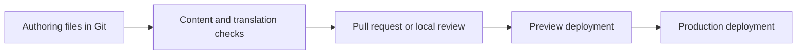

# ADR: Content-as-Code CMS Boundary

Status: accepted
Date: 2026-06-04
Owner: project maintainers
Applies to: multilingual showcase websites built from this starter

## Decision

The default content operating model for this starter is content-as-code.

Page content, locale-specific copy, SEO inputs, and replacement surfaces should
stay in the repository unless a derived project explicitly chooses a heavier CMS
lane. A CMS may be added as a thin authoring interface over approved repository
files, but it must not become the default source of truth for the whole site.

The first CMS proof, if needed, should be limited to repository-backed MDX page
content:

```text
content/pages/{locale}/*.mdx
```

Do not use Cloudflare D1, Payload, Strapi, Directus, Tina, Decap, Keystatic, or
any other CMS to take over all public content by default. Each candidate must be
judged by the exact content surface it will own.

## Context

This starter is a reusable company/product/service website starter, not a
general publishing platform. Its value comes from clear replacement surfaces,
multilingual routing, inquiry conversion, component governance, security basics,
and Cloudflare deployment proof.

The project already separates content into several different ownership layers:

- locale routing in `src/config/paths/locales-config.ts`;
- page prose and page SEO in `content/pages/{locale}/*.mdx`;
- UI messages in `messages/base/**` and `messages/profiles/**`;
- page expression in `src/config/single-site-page-expression.ts`;
- brand, SEO, links, and navigation in `src/config/single-site*.ts`;
- the default blog source in `src/lib/blog/starter-blog.ts`;
- optional catalog/product truth in typed config and fixture surfaces.

A single CMS cannot safely own all of these without weakening the boundaries
that make the starter maintainable.

## Why this decision

The useful lesson from the Cursor CMS migration is not "never use a CMS." It is
that a marketing site can lose a lot of engineering and agentic-editing leverage
when content moves behind a remote CMS abstraction.

For this starter, repository-owned content has practical benefits:

- agents and maintainers can search, review, and edit content with the same
  tools used for code;
- content changes can go through pull requests, CI, preview deployments, and
  normal rollback;
- multilingual files can be checked before release;
- page and component ownership stays visible;
- Cloudflare static or OpenNext deployment remains straightforward;
- content, proof, and project rules stay in one reviewable history.

This is especially important because the owner may use AI-assisted workflows.
Content that lives in Git is easier for agents to inspect and update without
inventing hidden CMS state.

## Approved default model

Default derived projects should keep this model:



For multilingual content, the default expectation is parallel locale files:

```text
content/pages/en/about.mdx
content/pages/zh/about.mdx
```

The default workflow for a new or changed page should be:

1. edit the default-locale content;
2. create or update the matching non-default-locale file;
3. use AI to draft translation when useful;
4. review terminology, facts, and SEO manually;
5. run content and translation checks;
6. publish through preview and deployment proof.

AI translation belongs in the authoring workflow. It must not become runtime
machine translation for public pages.

## CMS role

A CMS is allowed only as a bounded authoring interface. It may help non-technical
operators edit files, but it should not silently change the source of truth.

### Good first CMS scope

The safest first CMS proof is:

- About page MDX;
- Contact page MDX;
- Privacy page MDX;
- Terms page MDX;
- optional MDX pages only when the selected profile includes them.

These files already match the content-as-code model.

### Not approved as first CMS scope

Do not let an early CMS proof manage:

- `messages/base/**` or `messages/profiles/**`;
- `src/config/single-site-page-expression.ts`;
- `src/config/single-site-navigation.ts`;
- `src/config/single-site-product-catalog.ts`;
- `src/constants/product-specs/**`;
- `src/lib/blog/starter-blog.ts`;
- contact form behavior;
- email runtime behavior;
- security, rate limiting, or Turnstile policy;
- layout, component, or page structure.

These surfaces mix content with routing, behavior, governance, or typed product
contracts. They need their own design before being exposed to operators.

## Candidate fit

Candidate CMS tools should be judged by fit to a specific surface, not by broad
"supports Next.js" or "supports i18n" claims.

| Candidate | Current fit | Allowed default role |
| --- | --- | --- |
| Decap CMS | Good fit for Git-backed MDX page files; i18n folder support can match `content/pages/{locale}`. | Thin UI proof for MDX pages only. |
| Keystatic | Good local/schema-driven editing model, but production admin on the Cloudflare route must be proven. | Internal editor or PoC, not assumed production fit. |
| TinaCMS | Good editing experience, but multilingual and production backend shape need separate proof. | Future PoC only. |
| Payload CMS | Strong full CMS, but changes the project into a database-backed app. | Separate heavy-CMS lane. |
| Strapi | Mature external CMS, but requires a separate service and content adapter. | Customer-specific integration lane. |
| Directus | Strong data/admin tool for structured data, less natural for MDX page content. | Possible catalog/data lane, not page-content default. |
| Cloudflare D1 | Database primitive, not an authoring product. | Storage for a separately designed custom backend only. |

## D1 boundary

Cloudflare D1 is a serverless SQL database with SQLite semantics. It is useful
for structured data and Workers/Pages applications, but it does not provide a
CMS by itself.

D1 does not solve these authoring needs:

- operator login and permissions;
- rich text or MDX editing;
- multilingual side-by-side editing;
- drafts, approvals, and publishing workflow;
- media library;
- preview links;
- content versioning and rollback;
- integration with the starter's content checks.

Using D1 for public content means building a custom CMS. That is not the default
path for this starter.

## Multilingual operating rules

Any CMS or authoring workflow must preserve these rules:

- `LOCALES_CONFIG` remains the runtime locale truth.
- Public page content stays paired by locale.
- Missing locale files should block release or be clearly flagged.
- Slugs should stay stable across locales unless a separate localized-routing
  decision is approved.
- `seo.title`, `seo.description`, `updatedAt`, and `lastReviewed` remain
  operator-visible fields for MDX pages.
- Translated content must be reviewed for business facts, legal statements,
  product claims, and contact promises.
- Generated compatibility message files are not hand-edited.

## Blog and resources boundary

The default `company-site` blog is an explicit TypeScript data-source exception
in `src/lib/blog/starter-blog.ts`. Do not migrate it to MDX as an ad hoc CMS
follow-up.

If a derived project needs operator-managed blog articles, first design a
dedicated blog content-source lane that covers:

- article schema;
- locale pairing;
- slug and sitemap behavior;
- generated manifest impact;
- preview behavior;
- migration from the current starter blog source;
- tests and content checks.

Resources are also not automatically CMS-ready. The Resources page currently
mixes messages and page-expression configuration. Exposing it to operators needs
a separate content-model decision.

## Assets boundary

Do not make a CMS CDN the default asset truth.

Default image assets may stay under `public/images/**`. A derived project may
upgrade to Cloudflare Images, Cloudflare R2, or another media system only after
the project confirms upload, preview, cache, cost, and rollback behavior.

For this starter, the CMS should reference approved assets rather than own the
entire asset pipeline by default.

## First proof plan

If maintainers decide to test CMS editing, run a narrow proof:

1. Choose Decap CMS or Keystatic.
2. Expose only `content/pages/{locale}/*.mdx` for About, Contact, Privacy, and
   Terms.
3. Keep page structure, messages, blog, products, forms, email, and security out
   of scope.
4. Save edits back to Git.
5. Run:

```bash
pnpm content:check
node scripts/starter-checks.js translations
node scripts/starter-checks.js content-readiness --profile company-site
```

6. Prove preview deployment behavior before recommending the tool for derived
   projects.

Passing this proof approves only the scoped MDX editing surface. It does not
approve a full CMS migration.

## When a heavier CMS is allowed

A heavier CMS lane may be right for a customer project when the project needs:

- a non-technical content team with daily publishing needs;
- role-based permissions beyond GitHub;
- approval chains or compliance logs;
- reusable structured content across multiple channels;
- large media workflows;
- real-time collaboration;
- product/catalog data that must be queried independently from page rendering.

That decision must be project-specific. It should include hosting, database,
auth, preview, cache, migration, rollback, and cost proof.

## External references

- Lee Robinson, `Coding Agents & Complexity Budgets`:
  `https://leerob.com/agents`
- Sanity response, `You should never build a CMS`:
  `https://www.sanity.io/blog/you-should-never-build-a-cms`
- Cloudflare D1 docs:
  `https://developers.cloudflare.com/d1/`
- Decap CMS i18n docs:
  `https://decapcms.org/docs/i18n/`

These references explain the tradeoff. The project decision above is based on
this starter's current content boundaries, not on a general rule that every
project should avoid CMS products.
