# 项目架构树状图

> 当前仓库真实结构的中文树状图。重点是“现在怎么跑”，不是未来多站点理想形态。

```mermaid
flowchart TB
    A["示例展示型公司官网项目<br/>单仓单站架构"] --> B["1. 交付与入口层"]
    A --> C["2. 页面与组件层"]
    A --> D["3. 内容与配置真相层"]
    A --> E["4. 业务处理与防护层"]
    A --> F["5. 外部服务层"]
    A --> G["6. 质量门禁与验证层"]

    B --> B1["浏览器访问"]
    B1 --> B2["Cloudflare Worker 入口"]
    B2 --> B3["中间件路由与安全头"]
    B3 --> B4["Next.js App Router 页面"]
    B4 --> B5["按语言分流<br/>en / zh"]

    C --> C1["页面壳层"]
    C1 --> C11["首页"]
    C1 --> C12["关于我们"]
    C1 --> C13["产品页 / 市场页"]
    C1 --> C14["博客页"]
    C1 --> C15["联系页"]
    C1 --> C16["隐私 / 条款"]

    C --> C2["复用组件层"]
    C2 --> C21["基础 UI 组件"]
    C2 --> C22["区块 sections"]
    C2 --> C23["blocks 业务区块"]
    C2 --> C24["布局组件<br/>header / footer / navigation"]

    C --> C3["留资交互层"]
    C3 --> C31["联系表单"]
    C3 --> C32["产品询盘抽屉"]
    C3 --> C33["博客订阅"]
    C3 --> C34["Turnstile 人机校验组件"]

    D --> D1["结构化站点配置"]
    D1 --> D11["品牌与站点身份"]
    D1 --> D12["产品目录"]
    D1 --> D13["SEO 配置"]
    D1 --> D14["单站点 truth 配置"]

    D --> D2["MDX 内容"]
    D2 --> D21["博客文章"]
    D2 --> D22["关于 / 隐私 / 条款草稿内容"]
    D2 --> D23["内容清单生成脚本"]

    D --> D3["国际化文案"]
    D3 --> D31["英文消息"]
    D3 --> D32["中文消息"]
    D3 --> D33["critical / deferred 拆分"]

    E --> E1["请求接入层"]
    E1 --> E11["Server Action"]
    E1 --> E12["API Route"]

    E --> E2["输入校验与安全"]
    E2 --> E21["表单 schema 校验"]
    E2 --> E22["客户端 IP 提取"]
    E2 --> E23["限流"]
    E2 --> E24["Turnstile 校验"]
    E2 --> E25["幂等保护"]

    E --> E3["业务核心处理"]
    E3 --> E31["联系表单 canonical 路径"]
    E3 --> E32["统一 Lead Pipeline"]
    E32 --> E321["联系线索"]
    E32 --> E322["产品询盘线索"]
    E32 --> E323["订阅线索"]

    E --> E4["缓存与可观测性"]
    E4 --> E41["缓存标签工具"]
    E4 --> E42["健康检查"]
    E4 --> E43["请求观测"]
    E4 --> E44["日志与指标"]

    F --> F1["Cloudflare Turnstile"]
    F --> F2["Airtable"]
    F --> F3["Resend"]
    F --> F4["Cloudflare 静态资源与 Worker"]
    F4 --> F41["OpenNext Worker"]
    F4 --> F42["静态资源绑定"]
    F4 --> F43["API split worker"]

    G --> G1["Vitest 单元/集成测试"]
    G --> G2["Playwright 端到端测试"]
    G --> G3["TypeScript 类型检查"]
    G --> G4["ESLint 规则检查"]
    G --> G5["本地 CI 脚本"]
    G --> G6["架构/真相/边界审查脚本"]
    G --> G7["Cloudflare 构建与发布验证"]
```



## 一句话理解

- 这不是“纯前端展示站”。
- 它本质上是一个 **带多语言内容系统、留资处理链、安全防护层、Cloudflare 部署链、以及大量自检脚本的 B2B 官网平台**。

## 最关键的主链路

```text
买家访问页面
  -> 中间件处理语言与安全头
  -> 页面渲染组件与内容
  -> 用户提交联系/询盘表单
  -> 校验 + 限流 + Turnstile + 幂等保护
  -> 进入统一 Lead Pipeline
  -> 写入 Airtable / 发送 Resend 邮件
  -> 记录日志、指标、缓存和健康状态
```
