# Website Production Workflow

> Historical starter workflow note. This file explains the original
> research-to-design handoff model. It is not current Tucsenberg product truth.
> For current Tucsenberg site maintenance, start with `docs/README.md`,
> `docs/ref/project.md`, `docs/use/content.md`, and `docs/use/deploy.md`.

这份文档把网站生产拆成一条线性流水线。它不是单纯的思维导图，而是可执行的
handoff 流程：每一步都有作用、输入、产物和进入下一步的 gate。

先读 `docs/use/project-workflow.md` 做流程路由。那份文档负责判断页面应走派生项目业务完整流程，还是走替换验证流程。
本文档主要记录完整 research-to-design 流程和 Deep Research prompt 模板。

适用范围：

- 从一个新业务方向开始做 company / showcase website。
- 用户主要提供业务资料和判断，不需要懂设计或代码。
- Deep Research 负责查证和引用。
- Pro / Thinking 负责定义问题和综合判断。
- Impeccable 负责页面设计决策。
- Codex / 项目 UI 系统负责生产落地、验证和沉淀。

## Linear workflow

```mermaid
flowchart LR
  A["0. 输入准备<br/>Project Research Input Pack"] --> B["1. Pro 定题<br/>Deep Research Round 1 Prompt"]
  B --> C["2. Deep Research Round 1<br/>Business, Content & Reference Discovery"]
  C --> D["3. Deep Research Round 2<br/>Website Pattern & Visual Language Extract"]
  D --> E["4. Pro / Codex 收口<br/>Research-to-Design Brief"]
  E --> F["5. Impeccable 设计<br/>Page Design + Derived DESIGN draft"]
  F --> G["6. 生产落地<br/>Tailwind + UI System + i18n"]
  G --> H["7. 验证上线<br/>Checks + Visual Review + Launch Proof"]
  H --> I["8. 复用沉淀<br/>Recipes + Patterns + Prompts"]
```



## Step-by-step table

| Step | Main owner | Purpose | Required input | Output | Gate |
| --- | --- | --- | --- | --- | --- |
| 0. 输入准备 | 用户 / Codex | 收集足够业务事实，避免调研跑偏 | 公司、产品、市场、客户、资料、限制 | Project Research Input Pack | 能清楚说明业务是什么、卖给谁、网站目标是什么 |
| 1. Pro 定题 | Pro / Thinking | 把业务资料整理成 Deep Research 可执行任务 | Project Research Input Pack | Deep Research Round 1 Prompt | prompt 有研究范围、输出结构、来源要求、禁止事项 |
| 2. Deep Research Round 1 | Deep Research | 查清业务、内容、竞品，并找出第二轮参考名单 | Round 1 Prompt | Business, Content & Reference Discovery | 有业务真相、内容风险、claims matrix、Round 2 推荐名单 |
| 3. Deep Research Round 2 | Deep Research | 对推荐网站做内容、页面、区块、视觉、token 细节层级提取 | Round 2 推荐名单 | Website Pattern & Visual Language Extract | 有 Notes for Impeccable，不只是泛泛参考 |
| 4. 设计方向收口 | Pro / Codex | 把两轮调研翻译成符合业务实际的设计基调 | 两轮调研报告 | Research-to-Design Brief | 能回答网站应给人什么感觉、为什么、借什么、不借什么 |
| 5. Impeccable 设计 | Impeccable | 作为页面设计师决定布局、视觉、token 策略和反 AI 味 | Research-to-Design Brief + 项目上下文 | Page Brief、原型、Critique、Derived DESIGN draft | 用户确认页面方向 |
| 6. 生产落地 | Codex / Cursor | 把设计落到项目自己的 UI 系统 | 设计交接、项目规则 | 页面、tokens、组件、i18n、Storybook states | 不绕过 `src/components/ui/*`、i18n、组件治理 |
| 7. 验证上线 | Codex / 项目验证 | 证明内容、视觉、组件、构建和部署可交付 | 生产实现 | check 结果、视觉审查、Cloudflare build、launch proof | 最小必要验证通过 |
| 8. 复用沉淀 | Codex / 维护者 | 把通用经验反哺 starter | 交付结果和复盘 | section recipes、pattern extracts、prompt 模板 | 只沉淀通用规则，不写入客户专属事实 |

## Where each tool is strongest

| Tool / role | Best use | Avoid |
| --- | --- | --- |
| Deep Research | 多来源调研、竞品发现、行业网站分析、引用报告 | 不要让它直接定最终设计 |
| Pro / Thinking | 定义研究任务、综合报告、筛选取舍、写设计 brief | 不要用它替代多来源查证 |
| Impeccable | 页面布局、视觉基调、token 策略、组件气质、反 AI 味 | 不要让它编业务事实 |
| Codex / Cursor | 落地到项目文件、组件、i18n、验证、文档沉淀 | 不要绕过项目 UI 入口 |

## Deep Research Round 1 input checklist

第一轮 Deep Research 的目标是得到业务与内容真相，同时产出第二轮要研究的
参考网站名单。要做好这一轮，最好先准备下面这些基础信息。

### Minimum required

| Input | What to provide | Why it matters |
| --- | --- | --- |
| Business summary | 公司或业务一句话说明 | 决定研究边界 |
| Product / service scope | 主营产品、服务、优先级、不做什么 | 防止调研跑到错误业务 |
| Target market | 国家、地区、语言、行业 | 决定竞品和内容来源 |
| Target audience | 采购、工程师、老板、经销商、系统集成商等 | 决定页面内容和 CTA |
| Website goal | 询盘、报价、SEO、品牌展示、广告落地页 | 决定内容优先级 |
| Existing competitors | 已知竞品 URL，若没有就说明没有 | 帮助 Deep Research 起步 |
| Anti-reference | 不想像的网站、风格或内容套路 | 避免输出泛模板 |
| Evidence rule | 哪些结论必须带来源，哪些 claim 必须标注风险 | 避免编造业务事实 |

### Strongly recommended

| Input | Examples |
| --- | --- |
| Existing website or old pages | 老网站 URL、旧文案、旧页面截图 |
| Product materials | 产品目录、规格表、brochure、PDF |
| Proof assets | 认证、检测报告、工厂照片、案例、客户行业、出口市场 |
| Sales knowledge | 常见客户问题、销售话术、询盘邮件、报价前需要确认的信息 |
| SEO / ads context | 关键词、目标国家、Google Ads 方向、已有广告页面 |
| Public-use boundaries | 哪些客户名、数据、图片、认证可以公开使用 |

### If information is missing

资料不完整也可以跑，但要在 prompt 里明确：

- 哪些信息缺失。
- 允许 Deep Research 自行寻找哪些内容。
- 哪些内容只能标注为 inferred，不能当成 confirmed。
- 不允许编造客户、认证、产能、案例或标准符合性。

## Deep Research Round 1 prompt template

把下面模板复制到 ChatGPT Deep Research，然后替换方括号内容。

```text
You are doing Deep Research for a new B2B / company / showcase website.

Goal:
Produce a business, content, and reference discovery report that will later be used by an Impeccable-based design workflow. This is not a final website copywriting task and not a visual design task. The output should establish what the website should say, why it should say it, what evidence supports it, what needs confirmation, and which websites should be studied in Round 2 for page/content/visual pattern extraction.

Project background:
- Business / company: [describe the business in 2-5 sentences]
- Product / service scope: [main products or services, priority order, and what is out of scope]
- Target market: [countries, regions, languages, industries]
- Target audience: [buyers, engineers, distributors, business owners, operators, etc.]
- Website goal: [inquiry, quote request, SEO, ads landing page, brand credibility, product catalog, etc.]
- Existing website or materials: [URLs, PDFs, brochures, product specs, old pages, image assets]
- Known competitors: [URLs, or write "unknown, please discover"]
- Anti-references: [websites or styles we do not want to resemble, and why]
- Public-use constraints: [what can be used publicly, what is internal only, what needs confirmation]

Research tasks:
1. Define the website positioning for this business.
2. Identify the target audience and their buying / evaluation questions.
3. Identify the product or service structure that the website should communicate.
4. Research competitor and industry content patterns: what they emphasize, how they present proof, how they structure product information, and what CTAs they use.
5. Identify proof / trust requirements: certifications, standards, specs, case evidence, production capability, photos, process proof, support proof, or other evidence.
6. Identify SEO and FAQ opportunities based on buyer questions and market language.
7. Build a claims matrix: which claims are supported, which are inferred, and which need customer confirmation.
8. Identify content risks: claims that should not be written without evidence.
9. Discover candidate reference websites for Round 2.

Round 2 reference discovery requirements:
Classify candidate websites into:
- Direct competitors
- High-quality same-industry websites
- Adjacent B2B websites with similar buyer logic
- Cross-industry visual references
- Relevant DESIGN.md / awesome-design-md samples if useful

For each candidate reference, provide:
- URL
- Company / site name
- Category
- Why it is relevant
- Which pages are worth studying in Round 2
- What should be extracted in Round 2
- What should not be copied
- Priority: high / medium / low
- Confidence: high / medium / low

Output format:
1. Executive Summary
2. Website Positioning
3. Target Audience and Buyer Questions
4. Product / Service Structure
5. Competitor and Industry Content Patterns
6. Proof / Trust Requirements
7. CTA Strategy
8. SEO / FAQ Opportunities
9. Claims Matrix
   - Claim
   - Status: confirmed / likely / inferred / needs confirmation
   - Evidence
   - Source
   - Website usage recommendation
10. Content Risks and Missing Information
11. Recommended Round 2 Research Set
12. Notes for Impeccable
13. Source List

Evidence rules:
- Cite sources for important findings.
- Clearly distinguish confirmed facts, likely conclusions, inferences, and items that need customer confirmation.
- Do not invent customers, certifications, production capacity, case studies, compliance claims, or market leadership claims.
- Do not copy competitor copy.
- Do not produce final webpage design, Tailwind code, or final website copy.

Final section:
Add "Notes for Impeccable" with concise design-relevant implications:
- What the site must make visitors understand quickly
- What proof must be close to which claims
- Which content should drive homepage structure
- Which CTAs are most appropriate
- Which AI-template patterns should be avoided
```

## Round 1 expected output quality

A usable Round 1 report should include:

- A clear website positioning statement.
- A list of target buyer questions and objections.
- A practical product / service structure.
- A proof / trust checklist.
- A claims matrix with source status.
- Content risks and missing information.
- A prioritized Round 2 website list.
- A short Notes for Impeccable section.

If those pieces are missing, do not start design yet. Ask Deep Research to refine the report.

## Round 2 handoff shape

Round 2 should start from the `Recommended Round 2 Research Set` produced by Round 1.
It should not rediscover the whole industry from scratch. It should extract:

- content patterns;
- page structure patterns;
- section patterns;
- visual language;
- token tendencies;
- do / don't notes;
- `Notes for Impeccable`.

The key instruction for Round 2 is: borrow design capabilities, not whole brand labels.
For example, a B2B website can borrow Apple-like whitespace and image rhythm without becoming
a consumer electronics site.

## Production boundary

Design output must eventually return to project-owned truth sources and wrappers:

- `src/components/ui/*`
- `src/components/sections/*`
- `content/pages/{locale}`
- `messages/{locale}`
- `src/config/single-site-*.ts`
- `src/app/globals.css`
- `DESIGN.md`
- `docs/design/truth.md`

External research, screenshots, `awesome-design-md`, block libraries, and HTML prototypes are inputs.
They are not production truth.

## Related docs

- `docs/use/replace.md`
- `docs/use/ai.md`
- `docs/design/truth.md`
- `docs/design/impeccable/design-workflow.md`
- `docs/design/impeccable/system/COMPONENT-GOVERNANCE.md`
- `docs/ref/ui-components.md`
- `docs/proof/launch.md`
